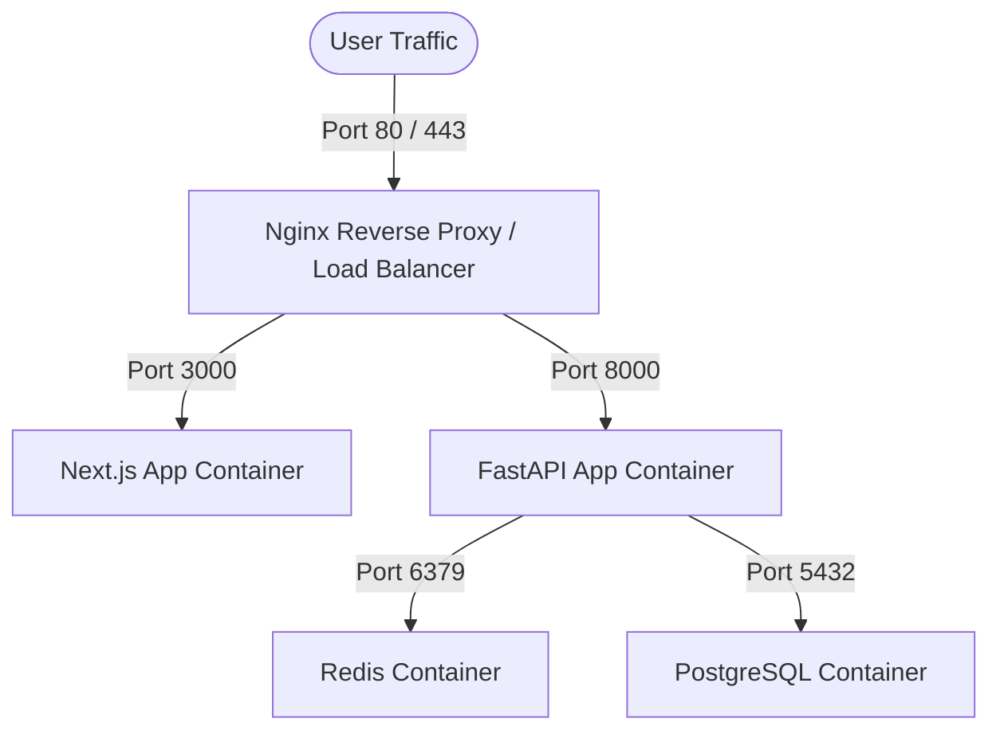

# Deployment & Operations - User Payout Management System

This document outlines the container deployment architecture, local docker-compose installation guides, operational check-sheets, and monitoring setups.

---

## 1. Local Container Stack Architecture

The deployment architecture is fully containerized, structured to orchestrate the following services:



---

## 2. Docker Compose Specifications
The root `docker-compose.yml` launches:
- **`db`**: PostgreSQL 16 database instance.
- **`redis`**: Redis instance for rate-limiting, request idempotency state caches, and mutex locks.
- **`backend`**: FastAPI backend service exposing APIs, auto-running migration seeds, and monitoring endpoints.
- **`frontend`**: Next.js service exposing the user portal and administrative dashboard.

---

## 3. Environment Configurations

### Backend Environment Variables (`backend/.env`)
```ini
DATABASE_URL=postgresql+psycopg://postgres:postgres_secure_pass@db:5432/payouts_db
REDIS_URL=redis://redis:6379/0
SECRET_KEY=9a6e3d23ab5f5a8946777a829f0aee0f0190bd0234a98a002bc
ACCESS_TOKEN_EXPIRE_MINUTES=30
ENVIRONMENT=development
SYSTEM_CURRENCY=INR
LOG_LEVEL=INFO
```

### Frontend Environment Variables (`frontend/.env.local`)
```ini
NEXT_PUBLIC_API_URL=http://localhost:8000/api/v1
```

---

## 4. Run Instructions (Local)

### Prerequisites
- Docker (v20.10+)
- Docker Compose (v2.0+)

### Launching the Stack
1. Clone the project files and navigate to the project root.
2. Run the compose command:
   ```bash
   docker-compose up --build -d
   ```
3. The services will initialize and start on:
   - **Frontend (UI)**: `http://localhost:3000`
   - **Backend API**: `http://localhost:8000`
   - **Swagger Docs**: `http://localhost:8000/docs`
   - **Prometheus Metrics**: `http://localhost:8000/metrics`

---

## 5. Production Infrastructure Checklist

When promoting this setup to production, implement the following practices:

1. **Database Resilience**:
   - Utilize a managed database service (e.g. AWS RDS PostgreSQL or GCP Cloud SQL) with Multi-AZ replication.
   - Run automated daily snapshot backups.
2. **Horizontal Scaling**:
   - Run the FastAPI service behind an Application Load Balancer inside AWS ECS/EKS or Google Kubernetes Engine (GKE).
   - Configure auto-scaling based on CPU utilization and request queues.
3. **Secret Security**:
   - Avoid plain-text environment files. Inject credentials via AWS Secrets Manager or HashiCorp Vault.
4. **Monitoring & Alerts**:
   - Bind Prometheus scraping endpoints to Grafana dashboards.
   - Set alerting triggers for database connection pool exhaustion and elevated error counts (HTTP 5xx rates > 1%).
