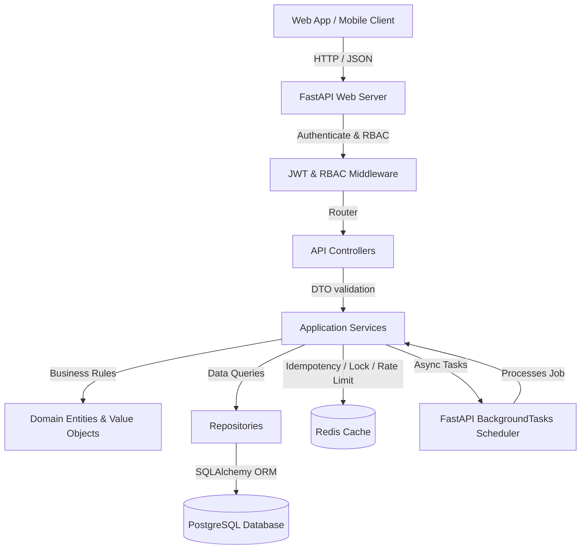
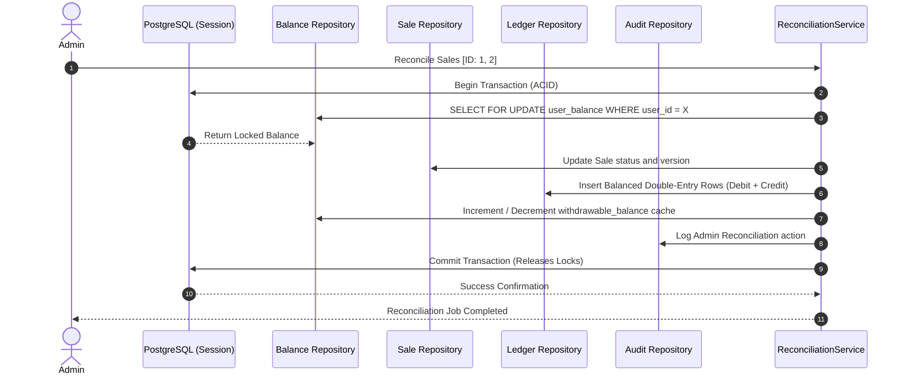
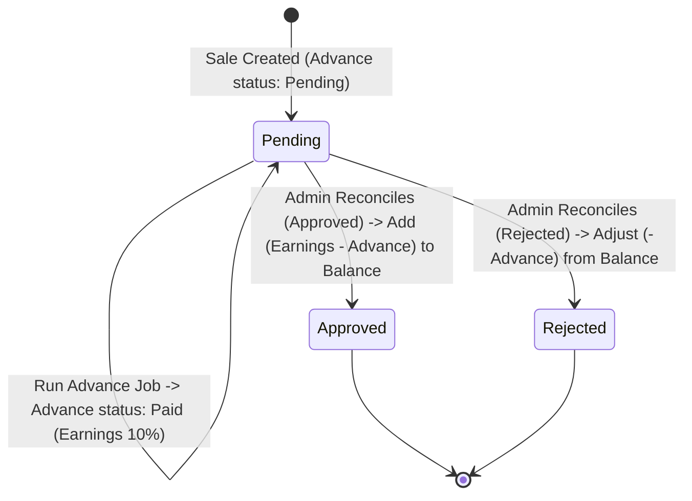
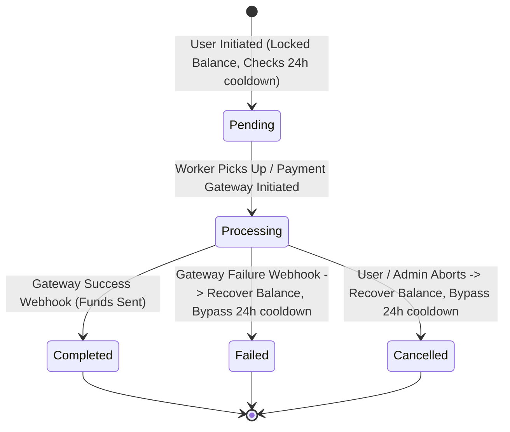
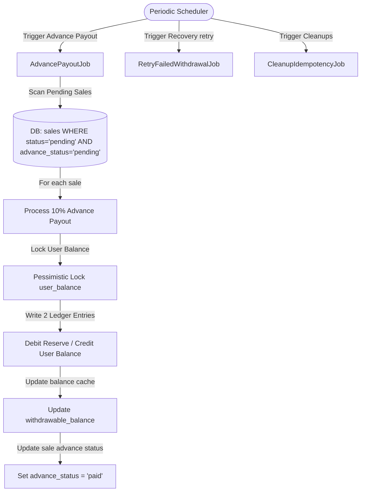
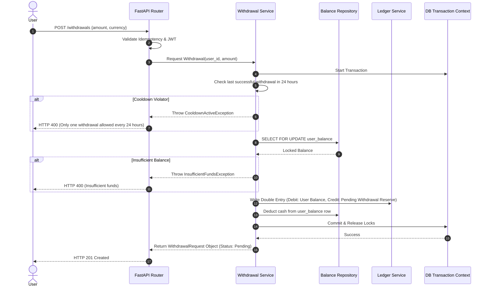
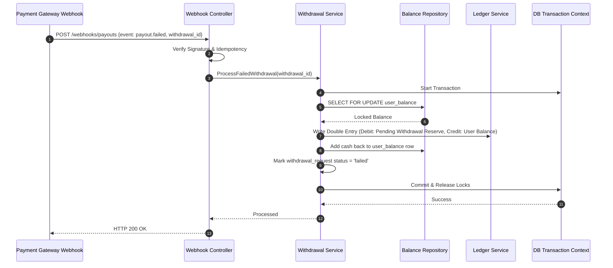
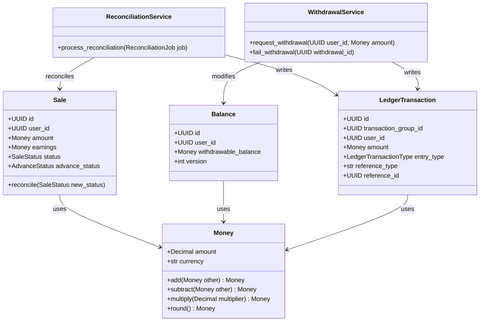

# Low-Level Design (LLD) - User Payout Management System

This document outlines the detailed system architecture, system components, sequence flows, state machines, and class structures for the User Payout Management System.

---

## 1. System Overview & Architecture

The system is designed as a production-grade, double-entry financial ledger system using **Domain-Driven Design (DDD)** and **Clean Architecture**. The layout ensures clean separation of concerns:

- **API Controllers (Interface Adapter)**: Handle HTTP requests, manage routing, run authentication middlewares, and process inputs/outputs via DTO schemas.
- **Application Services (Use Case)**: Coordinate the execution of business processes (e.g., triggering advance payouts, reconciling batches, requesting withdrawals).
- **Domain Layer (Entities & Value Objects)**: The core system containing pure business logic (e.g., `Money` arithmetic, state transitions) isolated from frameworks.
- **Repository Layer (Interface/Infrastructure)**: Handles data mapping between DB entities and domain models.
- **Infrastructure (Database / Caching / Queue)**: PostgreSQL for storage, Redis for rate-limiting & idempotency, and background tasks for scheduler processes.

### Component Diagram

---

## 2. Functional & Non-Functional Requirements

### Functional Requirements
1. **Sale Lifecycle**: Register sales as `Pending`. Calculate earnings and make them eligible for advance payout.
2. **Advance Payout (10%)**: Calculate and distribute exactly 10% of earnings for eligible sales. Prevent double advance payouts.
3. **Admin Reconciliation**: Enable admins to bulk reconcile pending sales into `Approved` or `Rejected` states.
4. **Final Payout Calculation**:
   - **Case 1 (Approved)**: User receives remaining balance: `Earnings - Advance Paid`.
   - **Case 2 (Rejected)**: Adjustment of `-Advance Paid` is debited from user balance.
5. **Withdrawals**: Restrict users to one withdrawal per 24 hours. Ensure ACID locks.
6. **Failed Withdrawal Recovery**: Auto-restore the withdrawn amount to the user's balance and clear the 24h limit cooldown for that withdrawal.
7. **Double-Entry Ledger**: Every balance transition writes exactly one Debit and one Credit entry to `ledger_transactions`.

### Non-Functional Requirements
1. **Financial Precision**: No floating-point math. Enforce Python's `Decimal` type with scale 4 in database.
2. **Idempotency**: All writes must use an `X-Idempotency-Key` header with cached response bodies.
3. **Concurrency Control**: Pessimistic locks (`SELECT FOR UPDATE`) on the `balances` table to prevent race conditions during updates.
4. **Auditability**: Track all mutations, admin reconciliations, and background jobs with version columns and timestamps.

---

## 3. Database Transaction & Data Flow Diagram

---

## 4. State Machines

### Sale State Transition

### Withdrawal Request State Transition

---

## 5. Background Job Workflows

---

## 6. Sequence Diagrams

### 1. Withdrawal Flow (With Cooldown Check & Locks)

### 2. Failed Payout Recovery Flow

---

## 7. Class Interaction Diagram & Domain Layer Structure

---

## 8. Design Patterns Used

1. **Repository Pattern**: Decouples the domain services from SQLAlchemy ORM operations, allowing for isolated unit testing.
2. **Service Layer Pattern**: Concentrates use cases and transaction controls in services (e.g. `ReconciliationService`) rather than mixing logic inside API endpoints.
3. **Value Object Pattern**: `Money` wraps financial arithmetic, avoiding raw floats or unsafe decimal calculations and standardizing operations across currencies.
4. **Strategy Pattern (Notification)**: Swaps out notification dispatch channels (e.g. Email, SMS, In-App Logs) dynamically depending on settings.
5. **State Pattern (implicit)**: Tracks lifecycle transitions of Sales and Payouts to prevent invalid operations (such as approving an already approved sale).
